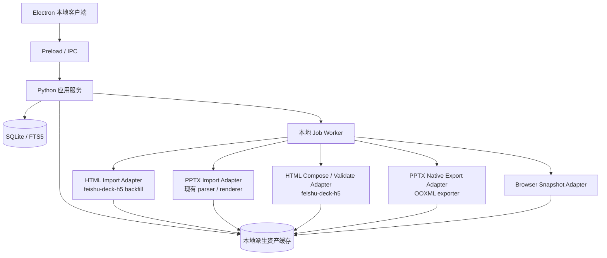

# HTML / PPTX 统一演示资产库功能规划与技术设计

- 初始调研日期：2026-07-18
- 最近修订日期：2026-10-02
- 状态：阶段 1 已实施；HTML 组合输出、混排导出和 Hybrid 能力仍按后续阶段推进
- 当前落地载体：本仓库的本地优先 Electron + Python 页库
- 长期演进方向：保留向 `feishu-solution-infra` 或团队服务迁移的适配器边界
- 调研样例：`/Users/bytedance/Downloads/lark-enterprise-doubao-2026-07-13.html`
- 在线样例：`https://magic.solutionsuite.cn/app/vtyZR0pI`（2026-09-26 访问返回 404，不能作为长期来源）

## 1. 执行摘要

本设计的目标，是让当前本地 PPT 页库未来能够统一管理 PPTX 和 HTML 演示页面，并支持导入、检索、预览、选片、组合与输出，同时不破坏正在验证的 PPTX 稳定链路。

结论如下：

1. **阶段 1 已完成。** 当前支持标准 render-deck HTML 的就地入库、检索、静态预览、隔离动态预览和选片；HTML 组合输出仍属于阶段 2。
2. 后续 HTML 能力应接入现有本地页库，而不是另建一个 HTML 素材库；PPTX 和 HTML 共用 Deck、Page、分类、检索和 Selection。
3. `feishu-deck-h5` 作为 HTML / DeckJSON 格式引擎，负责标准 HTML Deck 的恢复、组合、渲染、校验与打包；当前应用只通过适配器调用，不复制其内部实现。
4. 数据模型必须区分“来源格式”和“输出能力”。动态保留、视觉保真、原生可编辑是三种不同能力，不使用一个笼统的“支持导出”字段。
5. 第一阶段只支持可精确识别的 render-deck HTML。任意第三方网页、依赖未知脚本的 HTML 和在线 URL 抓取不进入首版承诺。
6. HTML 是保留动效、视频和交互的主输出；PPTX 是兼容性输出。HTML 页面导入 PPTX 时首版静态化，不承诺原生可编辑或保留动效。
7. 延续现有“源文件就地索引、不复制”原则。大型图片和视频不进入数据库；入库只记录依赖清单和内容摘要，组合导出时再从 hash 匹配的源文件按需抽取。
8. 若未来升级为团队共享系统，复用同一 Adapter Contract、`composition_ref` 和 Artifact Manifest，将存储与任务层迁移到 `feishu-solution-infra`，不重写格式引擎。

推荐的总原则是：

> 页库管资产、版本、检索、选片和任务；格式适配器管解析、依赖、渲染和导出。当前先落本地，长期可迁团队服务。

## 2. 背景与目标

当前 `ppt-page-library` 已经实现本地 PPTX 的就地索引、逐页检索、分类、缩略图与高清预览、页级删除、选片、排序和 PPTX 导出。未来希望加入类似 `lark-enterprise-doubao-2026-07-13.html` 的 HTML 演示文稿，并支持：

- 导入 HTML 演示或自包含 HTML 文件；
- 将 HTML 演示拆成可检索的页面；
- 与 PPTX 页面统一检索和筛选；
- 组合多个来源的页面；
- 优先导出新的 HTML 演示；
- 后续提供 HTML / PPTX 混合导出；
- 保留向团队共享、权限、版本追踪能力演进的接口，但不在本阶段建设团队服务。

最大的风险不是单个解析器难写，而是把以下职责混在一起：

- 产品资产模型；
- 文件格式模型；
- 页面检索模型；
- 组合依赖处理；
- 渲染与导出策略；
- 本地单机和团队服务两套部署模式。

本设计重点回答四个问题：

1. 现有四个相关项目已经具备哪些能力？
2. 哪些能力应成为主系统的一部分，哪些应保持为外部适配器？
3. 如何在不影响当前 PPTX 稳定性的前提下，把 HTML 能力接入现有本地页库？
4. 混合选片分别输出 HTML 和 PPTX 时，产品应承诺什么、不承诺什么？

### 2.1 当前阶段约束

截至 2026-09-26，现阶段约束如下：

- 当前客户端已经收敛为纯本地三步：导入并渲染、浏览与选片、组合导出。
- 源文件不复制，数据库记录绝对路径和 SHA-256；删除库内记录不触碰源文件。
- 页面缩略图和高清预览通过 `pptlib-asset://` 在 Electron 中加载。
- HTML 阶段 1 已通过 feature flag 接入；阶段 2 及以后不得与 PPTX 回归修复混在同一交付中。
- 任何未来迁移都必须保证现有 PPTX 数据、Selection 和 OOXML 导出行为不回归。
- 新能力默认通过 feature flag 或独立入口启用，未启用时现有流程和数据库行为保持不变。

## 3. 调研范围

### 3.1 当前项目

路径：`/Users/bytedance/bytedance-2026/10-ppt存档组合`

当前定位是本地 macOS PPT 页级资产库，技术栈为 Electron、Python、FastAPI、SQLite / FTS5、officecli / LibreOffice 和 OOXML 包级处理。

### 3.2 HTML 演示引擎

路径：`/Users/bytedance/Projects/feishu-deck-h5`

重点检查：

- DeckJSON 中间层；
- HTML renderer；
- HTML-only 产物的 backfill；
- deck-library 的归档、搜索和组合；
- HTML → PPTX snapshot / native / hybrid；
- PPTX → DeckJSON 的兄弟技能。

### 3.3 团队资产基础设施

路径：`/Users/bytedance/bytedance-2026/feishu-solution-infra`

重点检查：

- Source / Asset / Version / Artifact 模型；
- Deck / Page 拆解；
- PPTX、DeckJSON、render-deck HTML、manifest HTML 解析器；
- 检索、预览、Workset；
- REST / CLI / MCP / Next.js 工作台；
- 当前组合和实际导出的缺口。

### 3.4 PPTX 原生生产工具

路径：`/Users/bytedance/bytedance-2026/ppt-master`

重点检查 SVG → DrawingML 的可编辑 PPTX 路线及其与 HTML 系统的关系。

### 3.5 图片型 PPT 的 HTML 复刻兜底

路径：`/Users/bytedance/bytedance-2026/pptx-to-html-replica-skill`

重点检查其适用边界、自包含打包和妙搭发布能力。

## 4. HTML 样例实测结果

### 4.1 文件特征

调研样例：

```text
/Users/bytedance/Downloads/lark-enterprise-doubao-2026-07-13.html
```

实测信息：

- 文件大小约 36 MB；
- UTF-8 单文件 HTML；
- 包含 `fs-deck-generator=render-deck` 元信息；
- Deck ID 为 `dk-6a2c721117be`；
- 页面画布为 1920 × 1080；
- 共有 12 个 `.slide-frame`；
- 每页有稳定 `data-slide-key`；
- 页面全部使用 `data-layout="raw"`；
- 公共 CSS、运行时 JS、图片和视频均内嵌在 HTML 中；
- 多个 Demo 页面包含大型 Base64 MP4。

这说明样例不是任意网站，而是结构明确的 HTML 演示文稿。它天然适合使用 Deck / Page 模型，而不应按普通网页、DOM 区块或前端组件项目处理。

### 4.2 HTML → DeckJSON 反向恢复

使用 `feishu-deck-h5` 现有工具执行只读 dry-run：

```bash
python3 skills/feishu-deck-h5/deck-json/sync-index-to-deck.py \
  /Users/bytedance/Downloads/lark-enterprise-doubao-2026-07-13.html \
  /tmp/lark-enterprise-doubao-backfill/deck.json \
  --backfill --dry-run
```

结果：成功恢复 12 个页面，工具将来源识别为：

```text
self-rendered (data-slide-key, EXACT)
```

每页均保留：

- 页面 key；
- 页面 DOM；
- 页面独立 `custom_css`；
- 页序与 screen label；
- backfill 来源信息。

页面负载差异很大：

| 页面 | 恢复后主要内容大小 |
| --- | ---: |
| `cover` | 255 chars |
| `enterprise-value` | 1,647 chars |
| `four-pillars` | 916 chars |
| `highlight-scenes` | 1,039 chars |
| `demo-finance` | 约 10.2 MB |
| `demo-renewal` | 约 5.4 MB |
| `demo-market` | 约 11.6 MB |
| `demo-seedance` | 约 3.9 MB |
| `demo-ppt` | 约 4.9 MB |
| `demo-cross-device` | 约 1.3 MB |
| `workbuddy-compare` | 1,661 chars |
| `closing` | 256 chars |

结论：该格式的页面识别与恢复已具备现实基础，主要工程风险转移到了大型媒体资产的存储、去重、依赖闭包和组合。

### 4.3 校验结果

使用现有 validator 的无浏览器模式检查该 HTML：

```bash
python3 skills/feishu-deck-h5/assets/validate.py \
  /Users/bytedance/Downloads/lark-enterprise-doubao-2026-07-13.html \
  --no-visual
```

结果：

```text
slides: 12
errors: 0
warnings: 0
PASS
```

这证明该样例符合当前 `feishu-deck-h5` 的结构契约，可以作为后续真实入库和组合验收样例。

## 5. 现有项目能力盘点

### 5.1 `feishu-deck-h5`

#### 已具备能力

1. DeckJSON 是唯一事实来源，`index.html` 是确定性派生产物。
2. 页面具备稳定 key、layout、screen label、内容、CSS、来源等结构。
3. HTML-only 产物可以通过 `sync-index-to-deck.py --backfill` 恢复为 DeckJSON。
4. `render-deck.py` 可以重新渲染并执行静态、视觉和几何校验。
5. 交付链路支持目录包、自包含单文件 HTML、资源复制与发布前检查。
6. `deck-library` 已有归档、搜索、素材选择和 DeckJSON 组合脚本。
7. `html-to-pptx.py` 支持 HTML 页面截图式 PPTX 导出。
8. `deck-to-svg.py --pptx` 支持 schema 页面转可编辑矢量、raw 页面截图兜底的 hybrid 导出。
9. `pptx-to-deck` 可以把 PPTX 重建为 `layout:"canvas"` 的结构化 DeckJSON。

#### 关键限制

1. 现有 `deck-library` 以飞书 Base 为主要索引，数据模型与 `solution-infra` 重叠。
2. 现有组合逻辑以 `slide_payload_json` 为页面载荷，容易把大型 Base64 媒体重复写入页面记录。
3. `copy_asset_roots` 采用目录合并，跨来源重名资产仍需更严格的命名空间和依赖图策略。
4. HTML backfill 对自家 render-deck 产物是精确路径；对任意第三方 HTML 只是 best-effort。
5. native / hybrid PPTX 对 schema 布局有效；样例这类全 raw deck 仍会全部走 snapshot。

#### 推荐定位

`feishu-deck-h5` 应成为独立的 HTML / DeckJSON 格式引擎，不承担团队资产主库、权限和 Workset 的事实来源。

### 5.2 `feishu-solution-infra`

#### 已具备能力

1. PostgreSQL 主库和稳定 ID。
2. Source、Asset、Asset Version、Artifact、Deck Version、Page Version 模型。
3. 内容寻址 Artifact Store。
4. PPTX、DeckJSON、render-deck HTML、manifest HTML、opaque source 解析器注册机制。
5. render-deck HTML parser 能通过 generator meta 识别 HTML，并拆出页面 key、layout、screen label 和文本。
6. Deck / Page 检索、页面钻取、预览引用。
7. Workset 创建、加页、四种决策、排序和 manifest 导出。
8. REST / CLI / MCP 共用应用服务。
9. Next.js 团队工作台和异步 ingestion worker。
10. 飞书 Base 仅作为投影视图，而不是主库。

#### 当前缺口

1. Workset 只能导出 manifest，尚未真正生成 HTML 或 PPTX。
2. render-deck HTML parser 只提取检索元数据，尚未生成可组合的轻量 `composition_ref`。
3. HTML 页面预览当前主要依赖已有 preview 或文本占位；需要接入浏览器截图 worker。
4. PPTX parser 目前以 python-pptx 抽文本，页面类型默认 `replica_screenshot`，没有接入结构化 PPTX → Canvas DeckJSON。
5. 尚未形成 Export Job、Export Artifact、Renderer Profile 和 Compatibility Report 的稳定契约。
6. 尚未实现跨来源页面依赖闭包、资源命名空间和组合校验。

#### 推荐定位

若未来进入多人共享、权限治理和服务化阶段，`solution-infra` 可承接团队产品核心；它不是当前本地版接入 HTML 的前置依赖。

### 5.3 当前 `ppt-page-library`

#### 已具备能力

1. 本地 PPTX 扫描和上传。
2. ZIP 安全限制、部件数量和解压体积限制。
3. PPTX 文本、标题、备注提取。
4. 文件哈希、不可变版本和源文件变化校验。
5. SQLite / FTS5 中文检索。
6. 固定业务分类和页面用途分类。
7. officecli 优先、LibreOffice 回退的缩略图 / 高清预览。
8. 搜索、按内容找、按文件找、选片、排序和导出 UI。
9. OOXML 包级跨文件页面复制与输出 manifest。

#### 与主系统的重叠

以下能力与 `solution-infra` 已高度重叠：

- 数据库和迁移；
- Source / Deck / Page / Version；
- 入库任务；
- 搜索 API；
- 页面详情；
- 选片单 / Workset；
- Web 产品界面；
- 本地 Artifact 管理。

#### 独有且应继续复用的能力

1. `src/pptlib/export/ooxml.py` 的 PPTX 原生页面组合器。
2. 确定性业务 taxonomy 及其测试。
3. 源文件 hash 二次校验和 `SOURCE_CHANGED` 错误语义。
4. PPTX ZIP 包安全策略和关系闭包处理经验。
5. 已验证的双分辨率缩略图策略。
6. 本地闭环的产品交互经验和测试样例。

#### 推荐定位

当前项目继续作为本地页库产品主体。近期冻结 HTML 开发、优先完成 PPTX 稳定性验证；稳定后按本设计增加格式适配器，但不在本地版建设团队权限和第二套云端资产系统。

### 5.4 `ppt-master`

#### 已具备能力

1. 结构化内容 → SVG → DrawingML → 原生可编辑 PPTX。
2. SVG 与 DrawingML 都是绝对坐标二维画布，转换边界明确。
3. 文本、形状、图片、裁剪、渐变、动画等成熟工程能力。

#### 推荐定位

保持为独立生产工具和上游内容生产者。`feishu-deck-h5` 已经 vendored 了必要的 SVG → PPTX 能力，因此 `solution-infra` 不应依赖完整 `ppt-master` 工作流、角色系统或项目目录。

### 5.5 `pptx-to-html-replica-skill`

#### 已具备能力

1. 图片型 PPT 逐页视觉分析和人工重建。
2. HTML / CSS / SVG 自包含演示模板。
3. 本地资源递归收拢、越界引用改写、视频静态化和体积预算。
4. 妙搭发布与固定 App ID 更新。

#### 推荐定位

作为异常输入和高价值页面的人工升级通道，例如：

- 图片型 PPT；
- 无法结构化解析的复杂页面；
- 需要重做成 native H5 的高价值页面；
- 发布到妙搭的专项交付。

它不是批量自动导入器，也不应成为团队库的默认 parser。

## 6. 方案比较与当前选择

### 方案 A：在当前本地页库增加格式适配器

架构：

```text
DeckAtlas 本地应用
  ├─ 统一资产 / 版本 / 页面 / 检索 / Selection / Job
  ├─ PPTX import adapter  → 当前 parser + renderer
  ├─ HTML import adapter  → feishu-deck-h5 backfill
  ├─ PPTX export adapter  → 当前 OOXML exporter
  └─ HTML export adapter  → feishu-deck-h5 composer / renderer
```

优点：

- 直接复用已经稳定的本地选片体验；
- 用户不需要维护两套页库；
- 没有云端、权限和部署前置成本；
- 可以按阶段上线，失败时不影响现有 PPTX 主链路；
- Adapter Contract 可直接复用于未来团队化迁移。

代价：

- SQLite schema 需要向统一资产模型演进；
- Electron 需要增加隔离的动态预览容器；
- 浏览器渲染和媒体解包会增加本地运行时依赖。

结论：**当前推荐。**

### 方案 B：立即迁入 `solution-infra`

优点是天然支持团队权限、共享和服务化任务；缺点是会把当前需求扩大为一次平台迁移，并中断现有本地产品的稳定性验证。

结论：**保留为长期方向，不作为本轮 HTML 能力的前置条件。**

### 方案 C：PPTX 与 HTML 各自维护独立页库

优点是短期代码隔离；缺点是检索、Selection、版本、删除和导出状态全部分裂，混合组稿时还要再做一层跨库映射。

结论：**不采用。**

## 7. 推荐目标架构



### 7.1 核心边界

页库应用层不理解 CSS、OOXML relationship 或 SVG DrawingML 细节。它只理解：

- Source；
- Asset；
- Version；
- Page；
- Artifact；
- Workset；
- Export Job；
- Capability / Compatibility；
- Provenance。

格式适配器不拥有用户权限、检索索引和 Workset 状态。它们只接收不可变输入 Artifact 和结构化请求，返回 Manifest、Artifact 和诊断信息。

### 7.2 适配器契约

所有格式适配器至少提供四类能力：

```text
detect(source) -> Detection
ingest(source_snapshot) -> DeckManifest + PageManifest[]
render_preview(page_ref, profile) -> PreviewArtifact
compose(ordered_page_refs, output_profile) -> ExportResult
```

返回值必须包含：

- adapter 名称和版本；
- 输入 Source Version；
- 页面稳定 key 与顺序；
- 页面文本和检索元数据；
- 依赖 Artifact 清单；
- capability / warning；
- 输出文件、来源 manifest 和校验结果。

当前应用只能依赖此契约，不能直接依赖 `feishu-deck-h5` 的目录结构或私有函数。

## 8. 统一资产模型建议

### 8.1 不按格式拆表

禁止形成以下结构：

```text
ppt_decks / ppt_slides / html_decks / html_slides
```

推荐统一结构：

```text
Source
  └─ Deck Asset
       └─ Deck Version
            ├─ Page Asset / Page Version
            └─ Artifact Bindings
```

格式差异进入版本能力和 Artifact，不进入顶层资产身份。

### 8.2 Deck Version 建议字段

- `source_format`：`pptx`、`render_deck_html`、`deckjson_bundle`、`manifest_html`；
- `canonical_format`：优先 `deckjson_bundle`，无法恢复时为 `opaque_bundle`；
- `source_path` 与 `source_sha256`；
- `canonical_artifact_id`；
- `renderer_profile`；
- `renderer_version`；
- `aspect_ratio`；
- `page_count`；
- `structure_hash`；
- `content_hash`；
- `fidelity_tier`；
- `capabilities_json`；
- `warnings_json`。

### 8.3 Page Version 建议字段

- `page_key`；
- `sequence`；
- `title`；
- `content_text`；
- `notes_text`；
- `role`；
- `page_type`：`schema_h5`、`raw_h5`、`canvas`、`replica_screenshot`、`opaque_html`；
- `preview_artifact_id`；
- `composition_ref`；
- `source_metadata_json`；
- `classification_json`；
- `capabilities_json`。

### 8.4 `composition_ref` 而不是页面大载荷

页面记录不应保存完整 `slide_payload_json`、整页 HTML、Base64 图片或 Base64 视频。

建议引用结构：

```json
{
  "adapter": "feishu_deck_h5",
  "adapter_version": "2026.07",
  "source_version_id": "ver_xxx",
  "source_sha256": "sha256:...",
  "page_key": "demo-market",
  "dependency_manifest_id": "dep_xxx"
}
```

组合 worker 先校验源文件 hash，再根据引用读取源 HTML / bundle，提取页面和依赖闭包。若源文件已变化或丢失，与当前 PPTX 行为一致，阻止导出并提示重新定位或重新入库。

### 8.5 源文件与派生资产策略

源文件继续就地保存，不复制：

- 原始 PPTX；
- 原始 HTML / ZIP；

数据库只保存路径、文件 hash、版本、页面元数据和依赖摘要。以下派生资产允许进入本地缓存：

- 缩略图；
- 高清预览；
- 轻量 canonical DeckJSON；
- 选中页面导出时抽取的图片、视频和字体；
- 导出 HTML；
- 导出 PPTX；
- manifest 和 compatibility report。

派生缓存使用 SHA-256 内容寻址并支持垃圾回收。相同媒体只保存一份；未被选中导出的 Base64 视频不在导入阶段提前解包。

## 9. 导入流水线建议

### 9.1 通用阶段

```text
register source
  → path + hash version lock
  → detect adapter
  → parse metadata
  → materialize canonical representation
  → extract pages
  → render previews
  → enrich search/classification
  → commit version
```

### 9.2 render-deck HTML

1. 识别 generator meta。
2. 记录原始 HTML 的绝对路径、SHA-256、大小和修改时间，不复制源文件。
3. 使用 backfill 恢复 DeckJSON。
4. 扫描 data URI、相对资源和外部 URL，生成 dependency manifest；大型媒体只记录 digest、类型、大小和所属页面。
5. 保存去除大媒体载荷后的轻量 canonical DeckJSON；媒体引用仍可回到 hash 锁定的源文件。
6. 按 `page_key` 生成 Page Version。
7. 浏览器渲染缩略图和高清预览。
8. 写入 `composition_ref`。

导出时只为选中的页面解析依赖闭包，将所需媒体抽取到临时目录或内容寻址缓存，再生成最终 bundle。这样保持当前“不复制源文件”的产品承诺，也避免整份 HTML 重复占用磁盘。

### 9.3 PPTX

1. 记录原始 PPTX 的绝对路径和 SHA-256，不复制源文件。
2. 运行安全检查和基础文本提取。
3. 调用 `pptx-to-deck` 生成 Canvas DeckJSON bundle。
4. 使用 LibreOffice 生成视觉预览，作为视觉真值参考。
5. 使用 DeckJSON 结构生成可编辑 HTML 预览。
6. 将每页标记为 `canvas`，记录导出能力。

PPTX 原文件仍然是原生 PPTX 导出的最高保真来源；Canvas DeckJSON 是混合 HTML 组合的 canonical representation。

### 9.4 任意第三方 HTML

分级处理：

- 有 manifest：按 manifest 页面拆解；
- 有明确 slide DOM：best-effort 拆页；
- 无页面结构：作为 `opaque_html` 整体资产；
- 不在首版承诺任意网站区块级组合。

## 10. 检索与 Selection 建议

### 10.1 检索统一

用户不需要在两个资产库之间切换。统一页面搜索返回：

- 页面缩略图；
- 标题与摘要；
- 来源 Deck；
- 来源格式；
- 页面类型；
- 质量等级；
- 是否动态；
- 是否可编辑导出；
- 是否包含视频 / iframe；
- 分类和关键词。

来源格式应是一个过滤器或 badge，而不是独立产品入口。

### 10.2 Selection 保持格式无关

Selection item 只引用稳定的 Page / Page Version，不保存格式私有载荷。未来迁移到团队服务时可映射为 Workset item。

推荐增加：

- `locked_version_id`：组稿时锁定来源版本；
- `decision`：reuse / adapt / reference / generate；
- `slot`：章节或叙事位置；
- `position`；
- `note`；
- `requested_output_behavior`：preserve / flatten / rebuild。

### 10.3 导出前兼容性报告

导出对话框应先显示兼容性，而不是失败后才提示：

```text
HTML 导出：12/12 页面可用，6 页保留视频
PPTX snapshot：12/12 页面可用，所有页面静态化
PPTX hybrid：0/12 页面原生可编辑，12 页将作为图片
```

## 11. 组合设计建议

### 11.1 HTML 作为第一主输出

首阶段只承诺：

- HTML → HTML；
- PPTX(Canvas) → HTML；
- HTML + PPTX(Canvas) → HTML。

组合器不拼接最终 HTML 字符串，而是生成新的 DeckJSON，再由 renderer 产出 HTML。

### 11.2 页面提取

每个页面通过 `composition_ref` 从 canonical bundle 中提取：

- slide JSON；
- 页面独立 CSS；
- 页面依赖的图片、视频和字体；
- provenance。

### 11.3 资源命名空间

禁止简单把多个来源的 `assets/` 合并到同一路径。

推荐：

```text
assets/sources/<source-version-hash>/...
```

组合时重写页面引用。相同 SHA-256 的资源可在最终包中折叠为一份。

### 11.4 Key 和 CSS 冲突

组合器必须：

- 为重复 `slide_key` 生成新 key；
- 重写所有 page-scoped CSS selector；
- 重写 `data-text-id` 等页面内稳定 ID；
- 检查 DOM ID 冲突；
- 禁止外来可执行脚本直接传播；
- 保留来源映射 manifest。

### 11.5 运行时策略

最终 HTML 只加载一个目标 renderer runtime。来源页面不携带自己的全局运行时脚本。

对于依赖专有运行时的页面：

- 首版标记不兼容并拒绝动态组合；或
- 明确选择 flatten 为静态页面。

## 12. 导出能力矩阵

| 页面来源 | HTML 输出 | PPTX snapshot | PPTX hybrid / native |
| --- | --- | --- | --- |
| H5 schema | 保留 HTML 和动效 | 静态图片 | 可编辑矢量，接近原样 |
| H5 raw | 保留 HTML 和动效 | 静态图片 | 静态图片 |
| H5 iframe | 可保留或按策略静态化 | 静态图片 | 静态图片 |
| PPTX canvas | 结构化 HTML，近似原 PPT | 静态图片 | 后续可映射部分原生对象 |
| 原始 PPTX 页面 | 通过 Canvas 表示进入 HTML | 静态图片 | OOXML 原生复制，最高保真 |
| replica screenshot | 图片页 | 图片页 | 图片页 |

### 12.1 产品承诺

建议把导出能力明确分为：

- 动态演示：HTML；
- 视觉保真：PPTX snapshot；
- 可编辑输出：仅对明确支持的 schema / canvas / 原始 PPTX 页面承诺；
- 不承诺任意 raw HTML 转原生可编辑 PPTX。

## 13. 当前项目集成设计

### 13.1 当前保持不动的稳定主链路

HTML 后续阶段继续实施时，以下行为始终视为回归基线：

```text
PPTX 文件 / 文件夹
  → 就地扫描与 hash
  → 文本解析与分类
  → 缩略图 / 高清预览
  → 本地检索与选片
  → OOXML 原生组合
  → PPTX + manifest
```

HTML 开发不得改变：

- 现有 PPTX ID 的生成规则；
- 已导入 PPTX 的查询结果和分类；
- 默认 Selection 的顺序语义；
- 源文件 hash 校验；
- OOXML 原生页面复制；
- 删除索引不删除源文件的安全边界。

### 13.2 代码接入点

未来实施时优先在现有边界上扩展：

| 当前模块 | 规划改动 |
| --- | --- |
| `src/pptlib/discovery/scanner.py` | 从 PPTX-only 扩展为按 adapter 探测 `.pptx`、标准 `.html` 和 bundle `.zip` |
| `src/pptlib/application/import_decks.py` | 改为格式无关的 import coordinator，现有 PPTX 流程作为一个 adapter |
| `src/pptlib/ingestion/parser.py` | 保留 PPTX parser；新增独立 HTML adapter，不在此文件堆 HTML 分支 |
| `src/pptlib/rendering/` | 增加浏览器截图 adapter，产出同规格 thumbnail / preview |
| `src/pptlib/application/library.py` | SlideSummary 增加来源格式和能力字段 |
| `src/pptlib/application/compose.py` | 从直接调用 OOXML 改为先生成 Export Plan，再分派输出 adapter |
| `src/pptlib/export/ooxml.py` | 保持 PPTX 原生导出器职责，不加入 HTML 解析逻辑 |
| `desktop/main.js` | 文件选择支持 HTML / ZIP；动态预览使用独立 sandbox webContents |
| `desktop/renderer/app.js` | 增加格式 badge、动态预览入口和导出兼容性报告 |

### 13.3 数据模型演进

不新建 `html_decks` / `html_slides`。在现有 Deck / Version / Slide 结构上增加：

**Deck Version**

- `source_format`：`pptx`、`render_deck_html`、`deckjson_bundle`、`generic_html`；
- `canonical_format`：`pptx_package`、`deckjson_bundle`、`opaque_bundle`；
- 继续使用 `canonical_path`、`sha256`、`size_bytes` 和 `mtime_ns` 锁定本地源版本；
- `canonical_artifact_id`；
- `renderer_profile` 与 `renderer_version`；
- `capabilities_json` 与 `warnings_json`。

**Slide**

- `page_key`：HTML 稳定 key；PPTX 可继续使用页序派生 key；
- `page_kind`：`ooxml`、`h5_schema`、`h5_raw`、`h5_iframe`、`snapshot`；
- `composition_ref_json`；
- `capabilities_json`；
- `dynamic_preview_artifact_id`；
- `thumbnail_artifact_id` 与 `preview_artifact_id`。

Selection 继续只保存稳定 `slide_id` 和锁定的来源版本。格式信息不复制进 Selection Item。

### 13.4 HTML 来源边界

首版允许：

- 本地自包含 `.html`；
- render-deck 目录或 ZIP bundle；
- 带 `fs-deck-generator=render-deck`、`.slide-frame` 和稳定 `data-slide-key` 的标准产物。

首版不允许：

- 仅凭在线 URL 作为唯一来源；
- 任意网站 DOM 区块拆页；
- 需要登录态才能运行的远程页面；
- 未声明依赖的远程脚本；
- 页面内直接访问本机文件系统或 Electron API。

在线 URL 可以作为来源说明，但入库必须落到不可变的本地 HTML / bundle。此次
`https://magic.solutionsuite.cn/app/vtyZR0pI` 已返回 404，也说明 URL 不能承担长期资产身份。

这里的“不可变”指通过 SHA-256 锁定版本，并不代表复制源文件。源文件变化后产生新版本；旧 Selection 引用旧版本时，若本地已找不到匹配 hash，则禁止导出。

### 13.5 动态预览隔离

库卡片和列表始终显示静态缩略图。用户主动打开动态预览时：

- 使用独立 sandbox iframe 或 sandbox webContents；
- `nodeIntegration=false`、`contextIsolation=true`；
- 禁止访问 Electron preload 能力；
- 默认拦截新窗口、下载、顶层跳转和未知协议；
- 默认阻断外部网络，仅允许 dependency manifest 声明的本地 Artifact；
- 退出预览时暂停视频、释放页面和媒体资源。

不要把来源 HTML 直接插入 Electron 主 renderer DOM。

### 13.6 产品交互

页面卡片增加紧凑 badge：

- 来源：`PPTX` / `HTML`；
- 能力：`动态` / `视频` / `iframe` / `需联网`；
- 输出：`PPTX 原生` / `PPTX 静态` / `HTML 动态`。

高清预览默认仍是静态图。HTML 页面提供“播放动态版本”操作，只有用户触发时才启动 sandbox。

导出时先选择目标格式，再展示逐页兼容性：

```text
动态 HTML：10/10 页可用，3 页保留视频，2 个 PPTX 页面将静态嵌入
PPTX：10/10 页可用，7 页原生复制，3 个 HTML 页面将静态化
```

存在失败项时禁止导出；只有降级项时允许用户确认后继续。

### 13.7 输出产品形态

HTML 输出提供两种包装：

- **HTML Bundle ZIP（默认）**：`index.html + assets/ + manifest.json`，适合视频和大图；
- **单文件 HTML（可选）**：最终阶段重新内联资源，适合通过 IM 发送，但需显示文件体积。

PPTX 输出提供：

- **兼容模式（首版）**：原始 PPTX 页面走 OOXML；HTML 页面走 1920×1080 高分辨率静态图；
- **Hybrid（后续）**：H5 schema / canvas 映射原生对象，raw / iframe 继续静态化；
- **纯快照模式（兜底）**：所有页面静态化，用于跨格式一致性优先的交付。

### 13.8 必须保留的安全与可追溯能力

- 源版本 SHA-256 校验；
- HTML / ZIP 文件大小、成员数量和解压体积限制；
- ZIP 路径穿越检查；
- data URI 扫描和按需解包体积限制；
- 外部 URL、脚本、iframe 和字体清单；
- 页面依赖闭包校验；
- renderer / adapter 版本；
- 输出 manifest；
- 原子发布；
- 结构化错误码与逐页 warning。

## 14. 分阶段路线

### 阶段 0：验证 PPTX 基线（已完成）

该阶段已完成，为 2026-10-02 启动 HTML 阶段 1 提供基线。

退出条件：

- 真实 PPTX 批量导入、重复检测和中断恢复稳定；
- 缩略图与高清预览无持续性失败；
- 文件级和页级删除不误伤源文件；
- 典型跨文件组合导出通过结构和视觉抽查；
- 已知 OOXML 媒体、母版和关系闭包问题形成明确清单；
- 当前未提交改动完成验证并形成稳定基线。

### 阶段 1：HTML 只读入库（已完成）

范围：

- 支持选择本地 render-deck HTML / bundle；
- exact backfill；
- 大型 data URI 依赖扫描、摘要和页级归属；
- 文本抽取、分类、FTS；
- 静态缩略图和高清预览；
- 页面卡片显示来源和能力；
- sandbox 动态预览；
- 暂不支持 HTML 组合导出。

验收样例使用本次 36 MB、12 页 HTML。此阶段完成后，HTML 页面可以“看、搜、选”，但不承诺输出。

2026-10-02 实施结果：

- 真实样例恢复并入库 12/12 页，重复导入 12/12 页直接复用版本和预览缓存；
- 静态预览统一生成 640 和 1440 长边 JPEG，视频页使用 poster，不自动播放；
- 动态预览通过临时 loopback capability URL 和独立 Electron sandbox 窗口提供；
- 来源脚本、事件属性、iframe、表单、外部网络和未知协议均被阻断；
- 内嵌图片、视频和字体按所选页面临时解码，不进入 SQLite 或 canonical JSON；
- HTML 页面可检索、筛选、预览和加入 Selection，但任何含 HTML 的 Selection 都禁止进入 OOXML 导出。

### 阶段 2：HTML 同格式组合与输出

范围：

- 只允许 HTML 页面组成 Selection；
- 通过 `composition_ref` 提取页面与依赖闭包；
- 解决 key、DOM ID、CSS 和资源路径冲突；
- 目标 deck 只加载一套 renderer runtime；
- 输出 HTML Bundle ZIP；
- 可选输出单文件 HTML；
- validator、动态播放和来源 manifest 全部通过。

### 阶段 3：PPTX / HTML 混合组稿

范围：

- Selection 允许两种来源混排；
- 导出 HTML 时，PPTX 页面首版以高分辨率静态页面进入；
- 导出 PPTX 时，PPTX 页面原生复制，HTML 页面静态化；
- 导出前展示 Compatibility Report；
- 每页记录 `preserved`、`flattened` 或 `unsupported`。

### 阶段 4：结构化与 Hybrid 增强

范围：

- PPTX → Canvas DeckJSON；
- H5 schema / canvas → SVG → DrawingML；
- 原始 PPTX 页面继续优先走 OOXML；
- raw H5 / iframe 继续走 snapshot；
- 输出逐页 editability report；
- 在真实收益明确后，再评估任意第三方 HTML。

## 15. 主要风险与控制措施

### 15.1 大型内嵌媒体

风险：Base64 内容放进页面 JSON 会导致数据库膨胀、重复存储和查询变慢。

控制：入库时只生成摘要和依赖清单；导出选中页面时按需解包到临时目录或内容寻址缓存，数据库只保存引用。

### 15.2 页面依赖不完整

风险：只复制 DOM，不复制共享 CSS、字体、图片或运行时，会产生视觉缺失。

控制：canonical bundle + dependency manifest + 导出前依赖闭包校验。

### 15.3 CSS 和 ID 冲突

风险：来自不同 deck 的页面使用相同 key、DOM ID 或全局 selector。

控制：重命名空间、selector rewrite、禁止未声明全局 CSS。

### 15.4 外来脚本和 XSS

风险：导入 HTML 可能包含脚本、事件属性或外部资源。

控制：来源分级、foreign script gate、sandbox preview、发布前安全校验、默认不传播来源全局脚本。

### 15.5 格式能力被产品误解

风险：用户把 snapshot 当成可编辑输出，或把 PPTX Canvas 近似还原当成像素级还原。

控制：页面能力标签、导出兼容性报告、逐页 fidelity / editability disclosure。

### 15.6 格式引擎版本漂移

风险：旧 deck 用新 renderer 重渲后出现视觉变化。

控制：记录 renderer profile / version；保留原始 HTML；对高价值版本保留验证截图；必要时提供兼容 runtime 镜像。

### 15.7 重复系统继续增长

风险：当前项目、deck-library 和 solution-infra 同时增加团队资产功能。

控制：当前只维护一个可见页库产品；`feishu-deck-h5` 只作为格式引擎。未来团队化时整体迁移资产与任务层，不再并行建设第二套用户入口。

### 15.8 本地媒体性能

风险：多个视频页同时创建 DOM、解码 poster 或预加载视频，会显著增加 Electron 内存并拖慢选片。

控制：

- 网格只加载缩略图；
- 动态页面按需挂载；
- 离开预览立即暂停并销毁 webContents；
- 视频使用 `preload="metadata"` 或 `none`；
- 导出任务放 worker，避免阻塞 Electron renderer；
- 记录单页和整份 deck 的媒体体积预算。

## 16. 实施启动条件与第一批任务

只有阶段 0 的 PPTX 稳定性退出条件满足后，才进入 HTML 实施。

第一份实施前设计应聚焦一个可独立验收的子项目：

> render-deck HTML 导入 → exact backfill → 依赖扫描 → 页面检索 → 静态/动态预览。

建议依次确认：

1. Adapter Contract；
2. Canonical Bundle 格式；
3. `composition_ref` schema；
4. Artifact dependency manifest；
5. HTML 安全分级与 sandbox 策略；
6. Preview Job 和失败恢复；
7. capability / warning 字段；
8. 数据库迁移与旧库回滚策略；
9. feature flag；
10. 36 MB HTML 样例的验收脚本。

第一批实现不得修改 OOXML exporter。混合导出在 HTML 只读入库稳定后单独立项。

## 17. HTML 能力验收标准

### 17.1 只读入库验收

使用本次真实 HTML 样例完成：

- 成功记录本地源路径并生成 hash 锁定版本；
- 识别为 render-deck HTML；
- 恢复 12 个稳定页面；
- 页面顺序和 key 与来源一致；
- 搜索能够命中标题、正文和关键页面；
- 12 页均有缩略图和高清预览；
- 视频不写入数据库，也不在导入阶段复制整份媒体；
- 静态预览不启动视频，动态预览按需启动且关闭后释放；
- 重复导入相同文件不产生重复版本或派生缓存；
- 修改文件后产生新版本而不覆盖旧版本；
- 非 render-deck HTML 不会被误判为 exact backfill。

### 17.2 HTML 组合验收

- 从不同 HTML Deck 中任选 5 页并重新排序；
- 导出 HTML Bundle 和单文件 HTML；
- 输出通过 validator，并在浏览器中正确翻页；
- 被选中的视频页能够按策略保留或静态化；
- 输出不存在 CSS、DOM ID、资源路径和 slide key 冲突；
- manifest 可追溯到原始 Deck Version 和 Page Version。

### 17.3 混合组稿验收

- PPTX 与 HTML 页面可在同一 Selection 中排序；
- 输出 HTML 时，HTML 动态页保持动态，PPTX 页视觉可接受；
- 输出 PPTX 时，PPTX 页保持 OOXML 原生复制，HTML 页按报告静态化；
- 输出页数、顺序和来源与 Selection 完全一致；
- Compatibility Report 与实际输出逐页一致；
- 任一页面不可输出时，系统在写最终文件前阻止发布。

## 18. 已确认决策

截至 2026-09-26 已确认：

1. 当前先继续测试既有 PPTX 链路稳定性，不立即实施 HTML 功能。
2. HTML 是后续规划能力，届时接入当前本地页库，不新增独立 HTML 页库。
3. PPTX 与 HTML 共用检索、分类、选片和来源追溯。
4. `feishu-deck-h5` 作为 HTML / DeckJSON 格式引擎，以 adapter 方式复用。
5. 首批只支持可精确恢复的标准 render-deck HTML。
6. HTML 动态体验以 HTML 输出保留；输出 PPTX 时允许明确静态化。
7. PPTX 原生页面继续由现有 OOXML exporter 负责，HTML 逻辑不得进入该模块。
8. 在线 URL 不作为唯一资产来源，必须归档本地不可变 HTML 或 bundle。
9. 长期团队化方向保留，但不作为当前功能的前置项目。

## 19. 实施前尚需确认的设计决策

以下内容不阻塞阶段 1，但在 HTML 组合输出和混排导出启动前必须明确：

1. 格式适配器采用进程内 Python package，还是隔离的本地子进程 CLI；
2. canonical bundle 的本地物理封装采用目录、ZIP，还是 manifest + 分离 Artifact；
3. 大型视频默认保留、静态化，还是按导出目标选择；
4. renderer 版本是否需要长期并存；
5. HTML 单文件输出的默认体积阈值；
6. 动态预览是否完全断网，还是允许显式白名单；
7. PPTX 页面进入 HTML 时首版采用 PNG、WebP 还是 Canvas 转换；
8. iframe 页面默认拒绝、保留还是静态化；
9. renderer 升级后的旧版本兼容周期；
10. 团队化迁移触发条件。

这些决策应进入下一份正式设计文档，而不应通过实现细节默默决定。

## 20. 最终建议

当前最合理的路径不是立即开发，而是先把本地 PPTX 主链路跑稳，并把本设计作为后续实施基线。

启动 HTML 功能后：

1. 在当前页库中统一 Deck、Version、Page、Selection 和检索；
2. 把 `feishu-deck-h5` 接成 HTML / DeckJSON adapter；
3. 源文件继续就地索引；大媒体不进数据库，导出时按页抽取并进入可回收的内容寻址缓存；
4. 先完成 HTML 只读入库，再完成 HTML 同格式组合；
5. 最后增加 PPTX / HTML 混合组稿和双格式输出；
6. 对每页和每次导出明确展示 dynamic、fidelity 和 editability；
7. 团队化时迁移资产与任务层，保留格式适配器和 manifest 契约。

这条路线既能与当前本地产品连续演进，也不会把后续团队化能力锁死在 Electron、SQLite 或某一种演示格式里。
