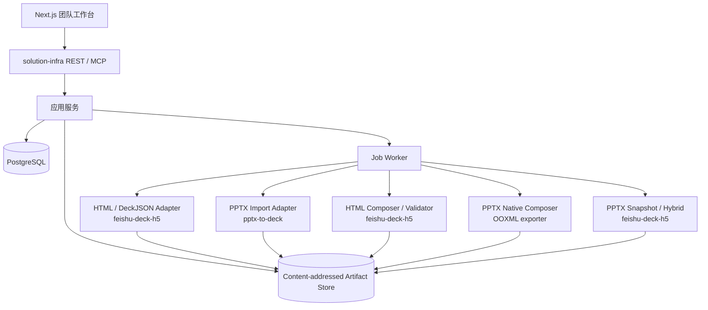

# HTML / PPTX 统一演示资产库调研与架构建议

- 日期：2026-07-18
- 状态：调研结论与后续设计输入
- 目标项目：`feishu-solution-infra`
- 当前仓库定位：PPTX 能力孵化与回归参考，不再扩展为第二套团队资产系统
- 调研样例：`/Users/bytedance/Downloads/lark-enterprise-doubao-2026-07-13.html`

## 1. 执行摘要

本次调研的目标，是判断现有 PPT 页库未来如何支持 HTML 演示项目的导入、检索、组合与导出，同时避免在产品、数据和格式处理层形成多套互相重叠的实现。

结论如下：

1. 团队共享资产库应以 `feishu-solution-infra` 为唯一产品核心。
2. `feishu-deck-h5` 应作为 HTML / DeckJSON 的格式引擎，负责 HTML 演示的恢复、组合、渲染、校验与打包。
3. `pptx-to-deck` 应作为 PPTX 到结构化 DeckJSON 的导入适配器。
4. 当前 `ppt-page-library` 不应继续扩展 HTML、团队权限或第二套资产模型；它应冻结产品扩展，保留为 PPTX 能力孵化仓，并将独有能力逐步迁入主系统。
5. `ppt-master` 保持独立的 PPTX 生产工具；在线系统只复用已稳定、已 vendored 的 SVG → DrawingML 能力，不把整个工作流作为运行时依赖。
6. `pptx-to-html-replica-skill` 适合作为图片型、异常型 PPT 的人工高保真兜底，不适合作为常规自动导入路径。
7. 产品路线应先完成 HTML 主格式闭环，再增加跨格式能力：先 B（HTML 组合与导出），再 C（HTML / PPTX 混合组合与多格式导出）。

推荐的总原则是：

> `solution-infra` 管资产、版本、检索、权限、组稿和任务；格式适配器管解析、组合、渲染和导出。

## 2. 背景与目标

当前 `ppt-page-library` 已经实现本地 PPTX 的导入、逐页检索、分类、预览、选片、排序和 PPTX 导出。未来希望加入类似 `lark-enterprise-doubao-2026-07-13.html` 的 HTML 演示文稿，并支持：

- 导入 HTML 演示或自包含 HTML 文件；
- 将 HTML 演示拆成可检索的页面；
- 与 PPTX 页面统一检索和筛选；
- 组合多个来源的页面；
- 优先导出新的 HTML 演示；
- 后续提供 HTML / PPTX 混合导出；
- 在团队环境中共享、授权、追踪版本和复用来源。

最大的风险不是单个解析器难写，而是把以下职责混在一起：

- 产品资产模型；
- 文件格式模型；
- 页面检索模型；
- 组合依赖处理；
- 渲染与导出策略；
- 本地单机和团队服务两套部署模式。

本次调研因此重点回答三个问题：

1. 现有四个相关项目已经具备哪些能力？
2. 哪些能力应成为主系统的一部分，哪些应保持为外部适配器？
3. 当前 `ppt-page-library` 应继续承担什么角色？

## 3. 调研范围

### 3.1 当前项目

路径：`/Users/bytedance/bytedance-2026/10-ppt存档组合`

当前定位是本地 macOS PPT 页级资产库，技术栈为 Python、FastAPI、Jinja2、SQLite / FTS5、LibreOffice、OOXML 包级处理。

### 3.2 HTML 演示引擎

路径：`/Users/bytedance/Projects/feishu-deck-h5`

重点检查：

- DeckJSON 中间层；
- HTML renderer；
- HTML-only 产物的 backfill；
- deck-library 的归档、搜索和组合；
- HTML → PPTX snapshot / native / hybrid；
- PPTX → DeckJSON 的兄弟技能。

### 3.3 团队资产基础设施

路径：`/Users/bytedance/bytedance-2026/feishu-solution-infra`

重点检查：

- Source / Asset / Version / Artifact 模型；
- Deck / Page 拆解；
- PPTX、DeckJSON、render-deck HTML、manifest HTML 解析器；
- 检索、预览、Workset；
- REST / CLI / MCP / Next.js 工作台；
- 当前组合和实际导出的缺口。

### 3.4 PPTX 原生生产工具

路径：`/Users/bytedance/bytedance-2026/ppt-master`

重点检查 SVG → DrawingML 的可编辑 PPTX 路线及其与 HTML 系统的关系。

### 3.5 图片型 PPT 的 HTML 复刻兜底

路径：`/Users/bytedance/bytedance-2026/pptx-to-html-replica-skill`

重点检查其适用边界、自包含打包和妙搭发布能力。

## 4. HTML 样例实测结果

### 4.1 文件特征

调研样例：

```text
/Users/bytedance/Downloads/lark-enterprise-doubao-2026-07-13.html
```

实测信息：

- 文件大小约 36 MB；
- UTF-8 单文件 HTML；
- 包含 `fs-deck-generator=render-deck` 元信息；
- Deck ID 为 `dk-6a2c721117be`；
- 页面画布为 1920 × 1080；
- 共有 12 个 `.slide-frame`；
- 每页有稳定 `data-slide-key`；
- 页面全部使用 `data-layout="raw"`；
- 公共 CSS、运行时 JS、图片和视频均内嵌在 HTML 中；
- 多个 Demo 页面包含大型 Base64 MP4。

这说明样例不是任意网站，而是结构明确的 HTML 演示文稿。它天然适合使用 Deck / Page 模型，而不应按普通网页、DOM 区块或前端组件项目处理。

### 4.2 HTML → DeckJSON 反向恢复

使用 `feishu-deck-h5` 现有工具执行只读 dry-run：

```bash
python3 skills/feishu-deck-h5/deck-json/sync-index-to-deck.py \
  /Users/bytedance/Downloads/lark-enterprise-doubao-2026-07-13.html \
  /tmp/lark-enterprise-doubao-backfill/deck.json \
  --backfill --dry-run
```

结果：成功恢复 12 个页面，工具将来源识别为：

```text
self-rendered (data-slide-key, EXACT)
```

每页均保留：

- 页面 key；
- 页面 DOM；
- 页面独立 `custom_css`；
- 页序与 screen label；
- backfill 来源信息。

页面负载差异很大：

| 页面 | 恢复后主要内容大小 |
| --- | ---: |
| `cover` | 255 chars |
| `enterprise-value` | 1,647 chars |
| `four-pillars` | 916 chars |
| `highlight-scenes` | 1,039 chars |
| `demo-finance` | 约 10.2 MB |
| `demo-renewal` | 约 5.4 MB |
| `demo-market` | 约 11.6 MB |
| `demo-seedance` | 约 3.9 MB |
| `demo-ppt` | 约 4.9 MB |
| `demo-cross-device` | 约 1.3 MB |
| `workbuddy-compare` | 1,661 chars |
| `closing` | 256 chars |

结论：该格式的页面识别与恢复已具备现实基础，主要工程风险转移到了大型媒体资产的存储、去重、依赖闭包和组合。

### 4.3 校验结果

使用现有 validator 的无浏览器模式检查该 HTML：

```bash
python3 skills/feishu-deck-h5/assets/validate.py \
  /Users/bytedance/Downloads/lark-enterprise-doubao-2026-07-13.html \
  --no-visual
```

结果：

```text
slides: 12
errors: 0
warnings: 0
PASS
```

这证明该样例符合当前 `feishu-deck-h5` 的结构契约，可以作为后续真实入库和组合验收样例。

## 5. 现有项目能力盘点

### 5.1 `feishu-deck-h5`

#### 已具备能力

1. DeckJSON 是唯一事实来源，`index.html` 是确定性派生产物。
2. 页面具备稳定 key、layout、screen label、内容、CSS、来源等结构。
3. HTML-only 产物可以通过 `sync-index-to-deck.py --backfill` 恢复为 DeckJSON。
4. `render-deck.py` 可以重新渲染并执行静态、视觉和几何校验。
5. 交付链路支持目录包、自包含单文件 HTML、资源复制与发布前检查。
6. `deck-library` 已有归档、搜索、素材选择和 DeckJSON 组合脚本。
7. `html-to-pptx.py` 支持 HTML 页面截图式 PPTX 导出。
8. `deck-to-svg.py --pptx` 支持 schema 页面转可编辑矢量、raw 页面截图兜底的 hybrid 导出。
9. `pptx-to-deck` 可以把 PPTX 重建为 `layout:"canvas"` 的结构化 DeckJSON。

#### 关键限制

1. 现有 `deck-library` 以飞书 Base 为主要索引，数据模型与 `solution-infra` 重叠。
2. 现有组合逻辑以 `slide_payload_json` 为页面载荷，容易把大型 Base64 媒体重复写入页面记录。
3. `copy_asset_roots` 采用目录合并，跨来源重名资产仍需更严格的命名空间和依赖图策略。
4. HTML backfill 对自家 render-deck 产物是精确路径；对任意第三方 HTML 只是 best-effort。
5. native / hybrid PPTX 对 schema 布局有效；样例这类全 raw deck 仍会全部走 snapshot。

#### 推荐定位

`feishu-deck-h5` 应成为独立的 HTML / DeckJSON 格式引擎，不承担团队资产主库、权限和 Workset 的事实来源。

### 5.2 `feishu-solution-infra`

#### 已具备能力

1. PostgreSQL 主库和稳定 ID。
2. Source、Asset、Asset Version、Artifact、Deck Version、Page Version 模型。
3. 内容寻址 Artifact Store。
4. PPTX、DeckJSON、render-deck HTML、manifest HTML、opaque source 解析器注册机制。
5. render-deck HTML parser 能通过 generator meta 识别 HTML，并拆出页面 key、layout、screen label 和文本。
6. Deck / Page 检索、页面钻取、预览引用。
7. Workset 创建、加页、四种决策、排序和 manifest 导出。
8. REST / CLI / MCP 共用应用服务。
9. Next.js 团队工作台和异步 ingestion worker。
10. 飞书 Base 仅作为投影视图，而不是主库。

#### 当前缺口

1. Workset 只能导出 manifest，尚未真正生成 HTML 或 PPTX。
2. render-deck HTML parser 只提取检索元数据，尚未生成可组合的轻量 `composition_ref`。
3. HTML 页面预览当前主要依赖已有 preview 或文本占位；需要接入浏览器截图 worker。
4. PPTX parser 目前以 python-pptx 抽文本，页面类型默认 `replica_screenshot`，没有接入结构化 PPTX → Canvas DeckJSON。
5. 尚未形成 Export Job、Export Artifact、Renderer Profile 和 Compatibility Report 的稳定契约。
6. 尚未实现跨来源页面依赖闭包、资源命名空间和组合校验。

#### 推荐定位

`solution-infra` 应成为唯一团队产品核心，负责所有格式无关的状态、权限、检索、组稿、任务和导出记录。

### 5.3 当前 `ppt-page-library`

#### 已具备能力

1. 本地 PPTX 扫描和上传。
2. ZIP 安全限制、部件数量和解压体积限制。
3. PPTX 文本、标题、备注提取。
4. 文件哈希、不可变版本和源文件变化校验。
5. SQLite / FTS5 中文检索。
6. 固定业务分类和页面用途分类。
7. LibreOffice → PDF → 缩略图 / 高清预览。
8. 搜索、按内容找、按文件找、选片、排序和导出 UI。
9. OOXML 包级跨文件页面复制与输出 manifest。

#### 与主系统的重叠

以下能力与 `solution-infra` 已高度重叠：

- 数据库和迁移；
- Source / Deck / Page / Version；
- 入库任务；
- 搜索 API；
- 页面详情；
- 选片单 / Workset；
- Web 产品界面；
- 本地 Artifact 管理。

#### 独有且值得迁移的能力

1. `src/pptlib/export/ooxml.py` 的 PPTX 原生页面组合器。
2. 确定性业务 taxonomy 及其测试。
3. 源文件 hash 二次校验和 `SOURCE_CHANGED` 错误语义。
4. PPTX ZIP 包安全策略和关系闭包处理经验。
5. 已验证的双分辨率缩略图策略。
6. 本地闭环的产品交互经验和测试样例。

#### 推荐定位

当前项目冻结产品扩展，继续作为 PPTX 能力孵化与回归参考。不要在此增加 HTML 导入、团队权限、统一资产模型或第二套混合组稿系统。

### 5.4 `ppt-master`

#### 已具备能力

1. 结构化内容 → SVG → DrawingML → 原生可编辑 PPTX。
2. SVG 与 DrawingML 都是绝对坐标二维画布，转换边界明确。
3. 文本、形状、图片、裁剪、渐变、动画等成熟工程能力。

#### 推荐定位

保持为独立生产工具和上游内容生产者。`feishu-deck-h5` 已经 vendored 了必要的 SVG → PPTX 能力，因此 `solution-infra` 不应依赖完整 `ppt-master` 工作流、角色系统或项目目录。

### 5.5 `pptx-to-html-replica-skill`

#### 已具备能力

1. 图片型 PPT 逐页视觉分析和人工重建。
2. HTML / CSS / SVG 自包含演示模板。
3. 本地资源递归收拢、越界引用改写、视频静态化和体积预算。
4. 妙搭发布与固定 App ID 更新。

#### 推荐定位

作为异常输入和高价值页面的人工升级通道，例如：

- 图片型 PPT；
- 无法结构化解析的复杂页面；
- 需要重做成 native H5 的高价值页面；
- 发布到妙搭的专项交付。

它不是批量自动导入器，也不应成为团队库的默认 parser。

## 6. 方案比较

### 方案 A：`solution-infra` 核心 + 格式适配器

架构：

```text
solution-infra
  ├─ 资产 / 版本 / 权限 / 检索 / Workset / Job / Artifact
  ├─ HTML adapter  → feishu-deck-h5
  ├─ PPTX importer → pptx-to-deck
  ├─ PPTX exporter → 当前项目 OOXML exporter
  └─ PPTX snapshot / hybrid → feishu-deck-h5 exporter
```

优点：

- 单一产品事实源；
- 格式能力可以独立升级；
- 团队权限、检索和组稿不会绑定某种文件格式；
- 现有项目可复用而不必大规模复制代码；
- 最适合长期演进。

代价：

- 需要正式定义 Adapter Contract；
- 需要管理 renderer / parser 版本；
- 需要异步作业和 Artifact 交接。

结论：推荐。

### 方案 B：把全部格式代码迁入 `solution-infra`

优点：

- 部署单一；
- 进程内调用简单；
- 事务边界直观。

缺点：

- `solution-infra` 会膨胀为格式处理大单体；
- `feishu-deck-h5` 和内置副本容易分叉；
- 校验器、renderer、PPTX exporter 都需要双处维护；
- 每次格式引擎升级都变成主系统升级。

结论：不推荐作为长期架构。

### 方案 C：保留多套产品，做松散联邦

组成：

- 当前项目管理本地 PPTX；
- deck-library / Base 管 HTML 素材；
- solution-infra 只聚合搜索。

优点：短期演示最快。

缺点：

- ID、版本和权限分散；
- Workset 跨系统引用脆弱；
- 重复检索和重复预览；
- 组合失败需要跨系统补偿；
- 用户无法判断哪套系统才是事实源。

结论：不符合团队共享目标。

## 7. 推荐目标架构



### 7.1 核心边界

`solution-infra` 不理解 CSS、OOXML relationship 或 SVG DrawingML 细节。它只理解：

- Source；
- Asset；
- Version；
- Page；
- Artifact；
- Workset；
- Export Job；
- Capability / Compatibility；
- Provenance。

格式适配器不拥有用户权限、检索索引和 Workset 状态。它们只接收不可变输入 Artifact 和结构化请求，返回 Manifest、Artifact 和诊断信息。

## 8. 统一资产模型建议

### 8.1 不按格式拆表

禁止形成以下结构：

```text
ppt_decks / ppt_slides / html_decks / html_slides
```

推荐统一结构：

```text
Source
  └─ Deck Asset
       └─ Deck Version
            ├─ Page Asset / Page Version
            └─ Artifact Bindings
```

格式差异进入版本能力和 Artifact，不进入顶层资产身份。

### 8.2 Deck Version 建议字段

- `source_format`：`pptx`、`render_deck_html`、`deckjson_bundle`、`manifest_html`；
- `canonical_format`：优先 `deckjson_bundle`，无法恢复时为 `opaque_bundle`；
- `entry_artifact_id`；
- `canonical_artifact_id`；
- `renderer_profile`；
- `renderer_version`；
- `aspect_ratio`；
- `page_count`；
- `structure_hash`；
- `content_hash`；
- `fidelity_tier`；
- `capabilities_json`；
- `warnings_json`。

### 8.3 Page Version 建议字段

- `page_key`；
- `sequence`；
- `title`；
- `content_text`；
- `notes_text`；
- `role`；
- `page_type`：`schema_h5`、`raw_h5`、`canvas`、`replica_screenshot`、`opaque_html`；
- `preview_artifact_id`；
- `composition_ref`；
- `source_metadata_json`；
- `classification_json`；
- `capabilities_json`。

### 8.4 `composition_ref` 而不是页面大载荷

页面记录不应保存完整 `slide_payload_json`、整页 HTML、Base64 图片或 Base64 视频。

建议引用结构：

```json
{
  "adapter": "feishu_deck_h5",
  "adapter_version": "2026.07",
  "canonical_artifact_id": "art_xxx",
  "page_key": "demo-market",
  "dependency_manifest_id": "art_dep_xxx"
}
```

组合 worker 根据引用读取不可变 canonical bundle，提取页面和依赖闭包。

### 8.5 Artifact 去重

所有大对象只保存一次：

- 原始 PPTX；
- 原始 HTML / ZIP；
- canonical DeckJSON bundle；
- 图片；
- 视频；
- 字体；
- 缩略图；
- 高清预览；
- 导出 HTML；
- 导出 PPTX；
- manifest 和 compatibility report。

Artifact 使用 SHA-256 内容寻址。页面只持有 Artifact ID，不复制内容。

## 9. 导入流水线建议

### 9.1 通用阶段

```text
register source
  → immutable snapshot
  → detect adapter
  → parse metadata
  → materialize canonical representation
  → extract pages
  → render previews
  → enrich search/classification
  → commit version
```

### 9.2 render-deck HTML

1. 识别 generator meta。
2. 保存原始 HTML Artifact。
3. 使用 backfill 恢复 DeckJSON。
4. 将大型 data URI 解包为内容寻址 Artifact，并把 DeckJSON 中的引用改成 bundle 内相对引用。
5. 保存 canonical DeckJSON bundle。
6. 按 `page_key` 生成 Page Version。
7. 浏览器渲染缩略图和高清预览。
8. 写入 `composition_ref`。

### 9.3 PPTX

1. 保存原始 PPTX Artifact。
2. 运行安全检查和基础文本提取。
3. 调用 `pptx-to-deck` 生成 Canvas DeckJSON bundle。
4. 使用 LibreOffice 生成视觉预览，作为视觉真值参考。
5. 使用 DeckJSON 结构生成可编辑 HTML 预览。
6. 将每页标记为 `canvas`，记录导出能力。

PPTX 原文件仍然是原生 PPTX 导出的最高保真来源；Canvas DeckJSON 是混合 HTML 组合的 canonical representation。

### 9.4 任意第三方 HTML

分级处理：

- 有 manifest：按 manifest 页面拆解；
- 有明确 slide DOM：best-effort 拆页；
- 无页面结构：作为 `opaque_html` 整体资产；
- 不在首版承诺任意网站区块级组合。

## 10. 检索与 Workset 建议

### 10.1 检索统一

用户不需要在两个资产库之间切换。统一页面搜索返回：

- 页面缩略图；
- 标题与摘要；
- 来源 Deck；
- 来源格式；
- 页面类型；
- 质量等级；
- 是否动态；
- 是否可编辑导出；
- 是否包含视频 / iframe；
- 分类和关键词。

来源格式应是一个过滤器或 badge，而不是独立产品入口。

### 10.2 Workset 保持格式无关

Workset item 只引用稳定的 Page Asset / Page Version，不保存格式私有载荷。

推荐增加：

- `locked_version_id`：组稿时锁定来源版本；
- `decision`：reuse / adapt / reference / generate；
- `slot`：章节或叙事位置；
- `position`；
- `note`；
- `requested_output_behavior`：preserve / flatten / rebuild。

### 10.3 导出前兼容性报告

导出对话框应先显示兼容性，而不是失败后才提示：

```text
HTML 导出：12/12 页面可用，6 页保留视频
PPTX snapshot：12/12 页面可用，所有页面静态化
PPTX hybrid：0/12 页面原生可编辑，12 页将作为图片
```

## 11. 组合设计建议

### 11.1 HTML 作为第一主输出

首阶段只承诺：

- HTML → HTML；
- PPTX(Canvas) → HTML；
- HTML + PPTX(Canvas) → HTML。

组合器不拼接最终 HTML 字符串，而是生成新的 DeckJSON，再由 renderer 产出 HTML。

### 11.2 页面提取

每个页面通过 `composition_ref` 从 canonical bundle 中提取：

- slide JSON；
- 页面独立 CSS；
- 页面依赖的图片、视频和字体；
- provenance。

### 11.3 资源命名空间

禁止简单把多个来源的 `assets/` 合并到同一路径。

推荐：

```text
assets/sources/<source-version-hash>/...
```

组合时重写页面引用。相同 SHA-256 的资源可在最终包中折叠为一份。

### 11.4 Key 和 CSS 冲突

组合器必须：

- 为重复 `slide_key` 生成新 key；
- 重写所有 page-scoped CSS selector；
- 重写 `data-text-id` 等页面内稳定 ID；
- 检查 DOM ID 冲突；
- 禁止外来可执行脚本直接传播；
- 保留来源映射 manifest。

### 11.5 运行时策略

最终 HTML 只加载一个目标 renderer runtime。来源页面不携带自己的全局运行时脚本。

对于依赖专有运行时的页面：

- 首版标记不兼容并拒绝动态组合；或
- 明确选择 flatten 为静态页面。

## 12. 导出能力矩阵

| 页面来源 | HTML 输出 | PPTX snapshot | PPTX hybrid / native |
| --- | --- | --- | --- |
| H5 schema | 保留 HTML 和动效 | 静态图片 | 可编辑矢量，接近原样 |
| H5 raw | 保留 HTML 和动效 | 静态图片 | 静态图片 |
| H5 iframe | 可保留或按策略静态化 | 静态图片 | 静态图片 |
| PPTX canvas | 结构化 HTML，近似原 PPT | 静态图片 | 后续可映射部分原生对象 |
| 原始 PPTX 页面 | 通过 Canvas 表示进入 HTML | 静态图片 | OOXML 原生复制，最高保真 |
| replica screenshot | 图片页 | 图片页 | 图片页 |

### 12.1 产品承诺

建议把导出能力明确分为：

- 动态演示：HTML；
- 视觉保真：PPTX snapshot；
- 可编辑输出：仅对明确支持的 schema / canvas / 原始 PPTX 页面承诺；
- 不承诺任意 raw HTML 转原生可编辑 PPTX。

## 13. 当前项目迁移方案

### 13.1 立即冻结的范围

当前 `ppt-page-library` 不再新增：

- HTML 导入；
- HTML 表和 HTML 专属领域对象；
- 混合 Workset；
- 团队账号和权限；
- 第二套 PostgreSQL 或云端服务；
- 新的团队 Web UI。

可以继续进行的工作仅限：

- 完成当前 PPTX M0 的稳定性收尾；
- 修复影响迁移能力的 PPTX 解析 / 导出缺陷；
- 补充独立格式适配器测试；
- 整理真实样本和兼容性矩阵。

### 13.2 第一优先迁移：OOXML 原生导出器

来源：

```text
src/pptlib/export/ooxml.py
```

目标形态：

```text
PptxNativeExportAdapter.compose(
  source_artifacts,
  ordered_page_refs,
  output_options
) -> ExportResult
```

必须保留：

- 源版本 SHA-256 校验；
- ZIP 安全检查；
- relationship 依赖闭包；
- content type 更新；
- 外部链接和不支持对象 warnings；
- manifest；
- 原子发布；
- 结构化错误码。

### 13.3 第二优先迁移：taxonomy

迁为 `solution-infra` enrichment job，不与导入事务耦合。

迁移内容：

- 8 × 4 固定业务分类；
- 页面用途；
- confidence；
- classification source；
- classifier version；
- 人工覆盖保护；
- 现有测试语料。

### 13.4 第三优先迁移：安全与预览经验

- ZIP 部件上限；
- 解压总大小上限；
- 路径穿越检查；
- 临时目录隔离；
- LibreOffice 独立 profile；
- 缩略图 / 高清预览双分辨率缓存；
- 超时和可重试错误分类。

### 13.5 不迁移的产品壳

- SQLite repositories；
- Jinja 页面；
- 当前 `/library`、`/selection` API；
- 默认 Selection Store；
- 独立本地 worker；
- 独立团队部署配置。

这些能力由 `solution-infra` 对应模块替代。

### 13.6 退役条件

满足以下条件后，当前仓库可转为只读参考：

1. `solution-infra` 完成 PPTX 导入、检索、预览、Workset、HTML 导出和 PPTX 原生导出闭环；
2. 当前项目的关键真实样本在新系统中通过；
3. OOXML exporter 的回归测试迁移完成；
4. taxonomy 结果兼容或完成显式版本升级；
5. 当前项目没有仍在使用的独立团队数据。

## 14. 分阶段路线

### 阶段 0：冻结边界与契约

目标：防止继续产生重复系统。

交付：

- 在 `solution-infra` 写 ADR；
- 定义 Adapter Contract；
- 定义 `composition_ref`；
- 定义 Export Job / Result；
- 定义 Capability / Compatibility Report。

### 阶段 1：HTML 同格式闭环

目标：先完成 B。

范围：

- 上传 render-deck HTML 或 ZIP；
- exact backfill；
- 大型 data URI 解包；
- 页面检索和预览；
- Workset 选择和排序；
- DeckJSON 组合；
- HTML 渲染、校验和下载；
- 来源 manifest。

验收样例使用本次 36 MB、12 页 HTML。

### 阶段 2：PPTX 混入 HTML

目标：开始 C 的主路径。

范围：

- PPTX → Canvas DeckJSON；
- PPTX 页面进入统一搜索；
- HTML / PPTX 页面混合 Workset；
- 混合 DeckJSON → HTML；
- LibreOffice 与浏览器预览对比。

### 阶段 3：PPTX snapshot 导出

范围：

- 任意混合 Workset 导出静态 PPTX；
- 每页一张高分辨率图片；
- 动效、视频和 iframe 静态化；
- 明确不可编辑提示。

### 阶段 4：能力感知的 hybrid / native 导出

范围：

- 原始 PPTX 页面优先走 OOXML 原生复制；
- schema H5 页面走 SVG → DrawingML；
- raw H5 页面走 snapshot；
- 输出逐页 editability report；
- 不支持对象显式 warning。

## 15. 主要风险与控制措施

### 15.1 大型内嵌媒体

风险：Base64 内容放进页面 JSON 会导致数据库膨胀、重复存储和查询变慢。

控制：导入时解包为内容寻址 Artifact，页面只保留引用。

### 15.2 页面依赖不完整

风险：只复制 DOM，不复制共享 CSS、字体、图片或运行时，会产生视觉缺失。

控制：canonical bundle + dependency manifest + 导出前依赖闭包校验。

### 15.3 CSS 和 ID 冲突

风险：来自不同 deck 的页面使用相同 key、DOM ID 或全局 selector。

控制：重命名空间、selector rewrite、禁止未声明全局 CSS。

### 15.4 外来脚本和 XSS

风险：导入 HTML 可能包含脚本、事件属性或外部资源。

控制：来源分级、foreign script gate、sandbox preview、发布前安全校验、默认不传播来源全局脚本。

### 15.5 格式能力被产品误解

风险：用户把 snapshot 当成可编辑输出，或把 PPTX Canvas 近似还原当成像素级还原。

控制：页面能力标签、导出兼容性报告、逐页 fidelity / editability disclosure。

### 15.6 格式引擎版本漂移

风险：旧 deck 用新 renderer 重渲后出现视觉变化。

控制：记录 renderer profile / version；保留原始 HTML；对高价值版本保留验证截图；必要时提供兼容 runtime 镜像。

### 15.7 重复系统继续增长

风险：当前项目、deck-library 和 solution-infra 同时增加团队资产功能。

控制：明确 `solution-infra` 是唯一主库，其他项目只通过适配器契约接入。

## 16. 后续在 `solution-infra` 的建议起点

切换到 `feishu-solution-infra` 后，建议先完成设计而不是立刻搬代码。

第一份实施前设计应聚焦一个可独立验收的子项目：

> render-deck HTML 导入 → exact backfill → Artifact 解包 → 页面检索 → Workset → HTML 组合导出。

建议依次确认：

1. Adapter Contract；
2. Canonical Bundle 格式；
3. `composition_ref` schema；
4. Artifact dependency manifest；
5. Export Job 和状态机；
6. HTML composer 的 key / CSS / asset rewrite 规则；
7. 兼容性报告；
8. 36 MB HTML 样例的验收标准。

当前项目的 OOXML exporter 迁移应作为随后独立子项目，不要与第一阶段 HTML 闭环混在同一实施计划中。

## 17. 阶段 1 建议验收标准

使用本次真实 HTML 样例完成：

- 成功上传并生成不可变 Source Snapshot；
- 识别为 render-deck HTML；
- 恢复 12 个稳定页面；
- 页面顺序和 key 与来源一致；
- 搜索能够命中标题、正文和关键页面；
- 12 页均有缩略图和高清预览；
- 视频不重复写入数据库；
- 从中任选 5 页重新排序并导出 HTML；
- 导出 HTML 通过 validator；
- 导出 HTML 在浏览器中可正确翻页；
- 被选中的视频页能够按明确策略保留或静态化；
- manifest 可追溯到原始 Deck Version 和 Page Version；
- 重复导入相同文件不产生重复 Artifact；
- 修改文件后产生新版本而不覆盖旧版本；
- 非 render-deck HTML 不会被误判为 exact backfill。

## 18. 已确认决策

本次讨论已确认：

1. 产品目标是团队共享资产库，而非单人本机工具。
2. 总体推荐采用 `solution-infra` 核心 + 格式适配器架构。
3. 产品路线先 B，再 C：先 HTML 组合导出，再逐步支持混合格式和多输出。
4. 当前 `ppt-page-library` 冻结产品扩展，保留为 PPTX 能力孵化与回归仓。
5. 当前项目的独有能力逐项迁入 `solution-infra`，不继续维护第二套团队产品。

## 19. 尚需在下一项目中做出的设计决策

以下内容不阻塞本次调研结论，但需要在 `solution-infra` 的下一轮设计中明确：

1. 格式适配器采用进程内 Python package、子进程 CLI，还是独立 worker image；
2. canonical bundle 的物理封装采用目录、ZIP，还是 manifest + 分离 Artifact；
3. 大型视频默认保留、静态化，还是按导出目标选择；
4. renderer 版本是否需要长期并存；
5. 团队权限落在 Deck、Page 还是 Source 层，并如何继承；
6. 页面人工分类如何与自动分类版本共存；
7. HTML 导出是否允许外部网络依赖；
8. 第三方 HTML 的首版支持边界。

这些决策应进入下一份正式设计文档，而不应通过实现细节默默决定。

## 20. 最终建议

不要在当前项目中直接增加 HTML 表、HTML 路由和 HTML exporter。这样做能快速出现界面，但会把格式处理和产品资产模型绑定在 SQLite / Jinja 的本地实现上，随后又必须向团队系统迁移一次。

正确路径是：

1. 在 `solution-infra` 统一资产、版本、权限、检索和 Workset；
2. 把 `feishu-deck-h5` 接成 HTML / DeckJSON adapter；
3. 把 `pptx-to-deck` 接成 PPTX → HTML canonical adapter；
4. 把当前项目的 OOXML exporter 接成 PPTX native export adapter；
5. 先打通 HTML 闭环，再增加 snapshot 和 hybrid / native PPTX；
6. 对每页和每次导出明确展示 fidelity、dynamic 和 editability。

这条路线能够最大化复用现有成果，同时避免继续形成重复系统。
